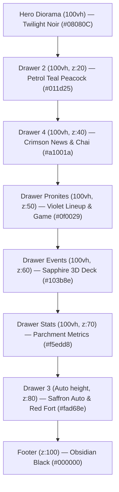

# Rendezvous IIT Delhi (`rendezvous-iitd.org`) — Master Architectural Report & Portfolio Blueprint

> **Forensic Deconstruction, Design System, Animation Mechanics, Micro-Interactions, Gestures, Asset Inventory & 1-to-1 Implementation Guide**  
> *Targeted for recreating an identical high-impact website or adapting it for a personal developer portfolio.*

---

## Table of Contents
1. [Executive Aesthetic & Design Metaphor](#1-executive-aesthetic--design-metaphor)
2. [Complete Color Palette & Token Architecture](#2-complete-color-palette--token-architecture)
3. [Typography Hierarchy & Font Stack](#3-typography-hierarchy--font-stack)
4. [Complete Animation Catalog (All 22 Bespoke Keyframes)](#4-complete-animation-catalog-all-22-bespoke-keyframes)
5. [Micro-Interactions, Gestures & Tactile Physics](#5-micro-interactions-gestures--tactile-physics)
6. [Section-by-Section Architectural & DOM Anatomy](#6-section-by-section-architectural--dom-anatomy)
7. [Full Asset Inventory (All 56 Media Files Mapped)](#7-full-asset-inventory-all-56-media-files-mapped)
8. [1-to-1 Portfolio Translation Blueprint](#8-1-to-1-portfolio-translation-blueprint)
9. [Production-Ready Reusable React Components](#9-production-ready-reusable-react-components)

---

## 1. Executive Aesthetic & Design Metaphor

Unlike standard SaaS web layouts that rely on flat dark mode and generic neon purple/cyan mesh gradients, **Rendezvous IIT Delhi** is designed as a **Maximalist Indian Vintage Carnival & Retro-Delhi Papercut Diorama**:

1. **Multi-Planar Parallax Stage**:
   - The hero section functions like an antique mechanical theater stage.
   - Distinct depth planes: Clouds $\rightarrow$ Back Trees $\rightarrow$ Glowing Sun/Flame $\rightarrow$ Concentric Vinyl Discs $\rightarrow$ India Gate $\rightarrow$ Rail Bridge $\rightarrow$ **Delhi Metro train driving across continuously over 14 seconds** $\rightarrow$ Foreground Foliage $\rightarrow$ Festival Emblem Banner.
2. **Physical "Sticky Drawer / Stacking Curtain" Architecture**:
   - Instead of standard page scrolling, every major section is an elevated slide with:
     ```css
     position: sticky;
     top: 0;
     left: 0;
     width: 100vw;
     height: 100vh;
     overflow: hidden;
     box-shadow: 0 -15px 40px rgba(0, 0, 0, 0.5);
     ```
   - As the user scrolls down, each section physically pulls up over the preceding one like a deck of playing cards or sliding curtains, casting realistic drop shadows on the layers below.
3. **Tactile Paper, Vintage Broadcast & Street Culture**:
   - Authentic torn paper borders (`paper-top.webp`, `paper-bottom.webp`).
   - Angled newspaper clippings that untilt and elevate on hover.
   - Steaming hot cup of cutting chai illustration with atmospheric shadows.
   - Vibrating transistor radio tuned to festival frequencies.
   - Delhi auto-rickshaw with engine chassis vibration and blinking headlights.

---

## 2. Complete Color Palette & Token Architecture

The website uses **8 distinct atmospheric color canvases**, giving each vertical drawer a unique, immersive identity:

### A. Section Canvas Colors (Drawer Backgrounds)

| Section | Color Token Name | Hex Code | RGB Values | Visual Metaphor & Atmosphere |
| :--- | :--- | :--- | :--- | :--- |
| **Hero Section** | Twilight Noir | `#08080C` | `rgb(8, 8, 12)` | Starry midnight Delhi sky |
| **Drawer 2 (Riot / Peacock)** | Deep Petrol Teal | `#011d25` | `rgb(1, 29, 37)` | Peacock plumage & cultural elegance |
| **Drawer 4 (Spilling Tea)** | Indian Crimson Red | `#a1001a` | `rgb(161, 0, 26)` | Newspaper print & cutting chai nostalgia |
| **Drawer Pronites (Lineup)** | Cosmic Indigo Violet | `#0f0029` | `rgb(15, 0, 41)` | Concert arena night with neon glow |
| **Drawer Events (Deck)** | Royal Sapphire Blue | `#103b8e` | `rgb(16, 59, 142)` | Electric carnival broadcast energy |
| **Drawer Stats (Numbers)** | Aged Parchment Ivory | `#f5edd8` | `rgb(245, 237, 216)` | Classic heritage gazette paper |
| **Drawer 3 (CAP / CRV)** | Warm Marigold Saffron | `#fad68e` | `rgb(250, 214, 142)` | Street festivity & Delhi auto nostalgia |
| **Navbar & Footer** | Pure Obsidian Black | `#000000` | `rgb(0, 0, 0)` | Anchoring high-contrast boundaries |

---

### B. Accent, Glow, and Functional Tokens

| Token Name | Hex Code | Application on Website |
| :--- | :--- | :--- |
| `--color-neon-yellow` | `#fbff00` | Pronite mystery spinner, badge tags, card hover halo (`box-shadow: 0 0 24px #fbff0040`) |
| `--color-gold-marigold` | `#f5c928` | Events progress track, counter badge (`01 / 17`), button hover outlines |
| `--color-gold-saffron` | `#fad68e` | Active nav link underline, brand titles, footer headers |
| `--color-crimson-dark` | `#7a1c1c` | Giant stat numbers (`500+`, `120K+`) on parchment canvas |
| `--color-crimson-glow` | `#ff2238` | Live broadcast red indicator dot glow (`box-shadow: 0 0 .25vw #ff2238`) |
| `--color-border-subtle` | `#ffffff1f` | Frosted card border (`rgba(255, 255, 255, 0.12)`) |
| `--color-border-hover` | `#dc2832a6` | Interactive crimson outline hover glow |
| `--color-text-ivory` | `#ffffffd9` | Subtitles, body copy, and secondary metadata |

---

### C. Signature Gradients

```css
/* 1. Pronite Artist Card Background */
background: linear-gradient(165deg, rgba(38, 12, 68, 0.8) 0%, rgba(15, 0, 41, 0.95) 100%);
border: 1.5px solid rgba(245, 237, 216, 0.22);

/* 2. Auto-Rickshaw Blinking Headlight Beam */
background: radial-gradient(#ffff96 0%, rgba(255, 215, 0, 0.8) 40%, rgba(255, 215, 0, 0) 75%);
filter: blur(4px) drop-shadow(0 0 20px rgba(255, 215, 0, 0.9));

/* 3. Card Bottom Vignette (Text Readability Overlay) */
background: linear-gradient(rgba(0, 0, 0, 0) 0%, rgba(0, 0, 0, 0.45) 40%, rgba(0, 0, 0, 0.9) 100%);

/* 4. Pronite Card Subtle Center Aura */
background: radial-gradient(circle at 50% 40%, rgba(138, 43, 226, 0.18) 0%, rgba(0, 0, 0, 0) 70%);
```

---

## 3. Typography Hierarchy & Font Stack

All fonts are imported from Google Fonts:
```css
@import "https://fonts.googleapis.com/css2?family=Bree+Serif&family=Rye&display=swap";
@import "https://fonts.googleapis.com/css2?family=Barlow+Condensed:ital,wght@0,400;0,500;0,600;0,700;0,800;0,900;1,400&display=swap";
@import "https://fonts.googleapis.com/css2?family=Dela+Gothic+One&display=swap";
```

### Font Roles & CSS Rules:
1. **`Rye` (Display & Vintage Carnival)**:
   - Woodblock Western / Circus vintage serif typeface.
   - Used for primary festival emblems, celebratory titles, and dramatic badges.
2. **`Barlow Condensed` (UI, Tickers, Metrics, Navigation)**:
   - Ultra-tight, high-impact condensed sans-serif with weights from `500` to `900`.
   - `letter-spacing: -0.02em` for giant stat numerals (`5.2vw` – `8.4vw`).
   - `letter-spacing: 0.08em` for navigation links and buttons.
   - `font-variant-numeric: tabular-nums` for rock-solid numeric countdowns without jitter.
3. **`Dela Gothic One` (Heritage Footer Title)**:
   - Extremely heavy, solid Japanese-gothic inspired display serif for `.common-footer-title`.
4. **`Bree Serif` (Editorial Accents)**:
   - Warm, charming serif used for subtitle headers, dates, and newspaper notes.

---

## 4. Complete Animation Catalog (All 22 Bespoke Keyframes)

Extracted directly from `portfolio/animations.css`:

### 1. Parallax Stage Motions
```css
/* Metro train crossing the bridge */
@keyframes metroDriveAcross {
  0%   { transform: translate(0); }
  100% { transform: translate(160vw); }
}

/* India Gate rising from bottom on initial entry */
@keyframes indiaGateRise {
  0%   { opacity: 0; transform: translateY(110%); }
  100% { opacity: 1; transform: translateY(0); }
}

/* Floating Delhi sky clouds */
@keyframes cloudsFloat {
  0%, 100% { transform: translateY(0); }
  50%      { transform: translateY(-1.5vw); }
}

/* Concentric rotating vinyl records */
@keyframes spinConcentric {
  0%   { transform: rotate(0deg); }
  100% { transform: rotate(360deg); }
}
@keyframes spinCenter {
  to { transform: rotate(360deg); }
}
```

### 2. Dual-Opposite Marquee Ribbons (Events Ticker)
```css
@keyframes eventsTickerScrollLeft {
  0%   { transform: translate(0); }
  100% { transform: translate(-50%); }
}

@keyframes eventsTickerScrollRight {
  0%   { transform: translate(-50%); }
  100% { transform: translate(0); }
}

.ticker-line-left .drawer-events-ticker-track {
  animation: 65s linear infinite eventsTickerScrollLeft;
  will-change: transform;
  white-space: nowrap;
  display: flex;
}

.ticker-line-right .drawer-events-ticker-track {
  animation: 65s linear infinite eventsTickerScrollRight;
  will-change: transform;
  white-space: nowrap;
  display: flex;
}
```

### 3. Opposing Multi-Column Vertical Marquees (Pronites)
```css
@keyframes pronitesScrollDown {
  0%   { transform: translateY(calc(-100% - 1.8vw)); }
  100% { transform: translateY(0); }
}

@keyframes pronitesScrollUp {
  0%   { transform: translateY(0); }
  100% { transform: translateY(calc(-100% - 1.8vw)); }
}

/* Staggered durations prevent synchronous alignment */
.drawer-pronites-col-1 .drawer-pronites-artists-group { animation: 24s linear infinite pronitesScrollDown; }
.drawer-pronites-col-2 .drawer-pronites-artists-group { animation: 20s linear infinite pronitesScrollUp; }
.drawer-pronites-col-3 .drawer-pronites-artists-group { animation: 23s linear infinite pronitesScrollDown; }
.drawer-pronites-col-4 .drawer-pronites-artists-group { animation: 21s linear infinite pronitesScrollUp; }
```

### 4. Interactive Delhi Cultural Micro-Animations
```css
/* Blinking headlights of the Auto Rickshaw */
@keyframes drawer3HeadlightBlink {
  0%, 100% { opacity: 1; }
  45%, 55% { opacity: 0.2; }
}

/* Auto-Rickshaw idling engine chassis vibration */
@keyframes drawer3CarWobble {
  0%, 100% { transform: rotate(0deg); }
  25%      { transform: rotate(-0.7deg) translateY(-1px); }
  75%      { transform: rotate(0.7deg) translateY(1px); }
}

/* Folk character dancing & head wobble */
@keyframes capPersonDance {
  0%, 100% { transform: translate(-0.5vw) scale(1.1); }
  50%      { transform: translate(0.5vw) scale(1.1) rotate(2deg); }
}
@keyframes capFigureWobble {
  0%, 100% { transform: rotate(-3deg); }
  50%      { transform: rotate(3deg); }
}

/* Transistor radio pulsing to bass */
@keyframes radioPopInOut {
  0%, 100% { transform: scale(1); }
  50%      { transform: scale(1.035); }
}

/* Question mark mystery shake */
@keyframes questionMarkShake {
  0%, 50%, 100% { transform: translate(-50%, -50%) rotate(0deg) scale(1); }
  15%, 35%      { transform: translate(-50%, -50%) rotate(-6deg) scale(1.05); }
  25%, 45%      { transform: translate(-50%, -50%) rotate(6deg) scale(1.05); }
}

/* Neon mystery wheel spinner */
@keyframes pronitesSpinRound {
  0%   { transform: rotate(0deg); }
  100% { transform: rotate(360deg); }
}

/* Meme reveal scale-in */
@keyframes pronitesMemeReveal {
  0%   { opacity: 0; transform: scale(0.92); }
  100% { opacity: 1; transform: scale(1); }
}

/* Broadcast live dot glow */
@keyframes ev2LiveDotGlow {
  0%, 100% { opacity: 1; transform: scale(1); box-shadow: 0 0 0.25vw #ff2238, 0 0 0.55vw #ff2238; }
  50%      { opacity: 0.4; transform: scale(0.85); box-shadow: 0 0 0.1vw #ff2238; }
}
```

---

## 5. Micro-Interactions, Gestures & Tactile Physics

The website engineers physical mechanical tactile feedback into every touch and hover:

### 1. The "Spring-Press" Button Clicks (`:active` States)
- **Navigation Buttons (`.drawer-events-btn`)**:
  - Resting: Frosted glass circle (`backdrop-filter: blur(4px); background: rgba(255,255,255,0.12); border: 1.5px solid rgba(255,255,255,0.35)`).
  - Hover: `transform: scale(1.12); border-color: #f5c928; filter: drop-shadow(0 0 12px rgba(245,201,40,0.7));`.
  - **Active / Tap**: Compresses like a physical spring:
    ```css
    .drawer-events-btn:active {
      transform: scale(0.92);
      transition: transform 0.1s ease-out;
    }
    ```
- **Mystery Guess Box (`.drawer-pronites-guess-box-wrapper`)**:
  - Hover: `transform: translateY(-4px) scale(1.01); filter: drop-shadow(0 0 14px rgba(251,255,0,0.25));`.
  - Active: `transform: translateY(-1px) scale(0.99);`.

### 2. Newspaper "Hover-Untilt & Elevate"
In the "Spilling Tea" section (`drawer4`), 4 news clippings sit at casual angles:
- Card 1: `rotate(-3.5deg)` | Card 2: `rotate(2.8deg)` | Card 3: `rotate(2.2deg)` | Card 4: `rotate(-3deg)`
- **On Hover**:
  ```css
  .drawer4-news-card-wrapper:hover {
    z-index: 10;
    transform: translateY(-8px) scale(1.05) rotate(0deg);
    filter: drop-shadow(0 16px 30px rgba(0, 0, 0, 0.6));
    transition: transform 0.3s cubic-bezier(0.2, 0.8, 0.2, 1), filter 0.3s;
  }
  ```

### 3. 3D Card Stack Gesture (`perspective: 1200px`)
Relative offset calculation ($n = \text{index} - \text{activeIndex}$):
- $n = 0$ (Active): `translateY(0) scale(1) rotate(0); opacity: 1; z-index: 15; box-shadow: 0 1.8vw 3.8vw rgba(0,0,0,0.65);`
- $n = 1$ (Next 1): `translateY(1.3vw) scale(0.95) rotate(2.8deg); opacity: 0.85; z-index: 14;`
- $n = 2$ (Next 2): `translateY(2.5vw) scale(0.9) rotate(-2.2deg); opacity: 0.6; z-index: 13;`
- $n = 3$ (Next 3): `translateY(3.6vw) scale(0.85) rotate(1.5deg); opacity: 0.35; z-index: 12;`
- $n < 0$ (Dismissed): `translateY(-8vw) scale(0.92) rotate(-5deg); opacity: 0; z-index: 20;`

All card state changes animate via:
`transition: transform 0.45s cubic-bezier(0.22, 1, 0.36, 1), opacity 0.45s cubic-bezier(0.22, 1, 0.36, 1);`

### 4. Interactive Mystery Game State Machine
1. **Idle**: Shaking question mark (`questionMarkShake`).
2. **Loading**: Clicking fires 5,000ms timer; displays spinning neon ring (`pronitesSpinRound`).
3. **Revealed**: Scale-in pop of meme/artist clue card (`pronitesMemeReveal`).
4. **Reset**: Clicking again resets state to `idle`.

### 5. Number Ticker with Custom Cubic Ease-Out Engine
```javascript
const NumberTicker = ({ end, active, duration = 1800 }) => {
  const [val, setVal] = useState(0);
  const doneRef = useRef(false);

  useEffect(() => {
    if (!active || doneRef.current) return;
    let start = null;
    let reqId = 0;

    const tick = (t) => {
      start ||= t;
      const progress = Math.min((t - start) / duration, 1);
      const easeOutCubic = 1 - Math.pow(1 - progress, 3);
      setVal(Math.round(easeOutCubic * end));

      if (progress < 1) {
        reqId = requestAnimationFrame(tick);
      } else {
        setVal(end);
        doneRef.current = true;
      }
    };

    reqId = requestAnimationFrame(tick);
    return () => reqId && cancelAnimationFrame(reqId);
  }, [active, end, duration]);

  return <span>{val}</span>;
};
```

### 6. Instant Route-Prefetching on Touch / Hover
```javascript
const getPrefetchProps = (route) => ({
  onMouseEnter: () => prefetchChunk(route),
  onTouchStart: () => prefetchChunk(route)
});
```

---

## 6. Section-by-Section Architectural & DOM Anatomy



### Section 1: Hero Parallax Diorama (`.hero2-section`)
- Background: `#08080C`
- Elements:
  - `hero2-clouds`: Drifting sky layer.
  - `hero2-back-tree`: Midground tree silhouettes.
  - `hero2-flame`: Sun/fire glow.
  - `hero2-discs-container`: 6 concentric rotating vinyl discs (`Events`, `CAP`, `CRV`, `Entry Pass`, `Register`, `Centre Disc`).
  - `hero2-india-gate`: Vector monument rising from bottom.
  - `hero2-bridge`: Structural rail bridge.
  - `hero2-metro`: Animated Delhi Metro train crossing the bridge over 14s.
  - `hero2-front-trees`: Dark foreground framing.
  - `hero2-rendezvous-vol49`: Festival banner emblem.

### Section 2: Deep Petrol Peacock Drawer (`.drawer2-section`)
- `z-index: 20` | `#011d25` | `position: sticky; top: 0`
- Elements: High-resolution peacock plumage texture, celebratory vector ribbon, majestic peacock illustration (`width: 80vw`), and typography emblem "A RIOT OF CULTURES".

### Section 3: "Spilling Tea" Newspaper Drawer (`.drawer4-section`)
- `z-index: 40` | `#a1001a` | `position: sticky; top: 0`
- Elements: Real torn paper top & bottom edges, "Spilling The Tea" retro banner, 4 tilted newspaper clippings with hover untilt, and steaming cutting chai cup illustration.

### Section 4: Pronite Star Night & Mystery Drawer (`.drawer-pronites-section`)
- `z-index: 50` | `#0f0029` | `position: sticky; top: 0`
- Elements: 4-column continuous opposing vertical marquees (Cols 1 & 3 scroll down, Cols 2 & 4 scroll up), interactive Mystery Guess Box state machine (Shake $\rightarrow$ Neon Spin Loader $\rightarrow$ Meme Clue Pop).

### Section 5: Events 3D Card Deck Drawer (`.drawer-events-section`)
- `z-index: 60` | `#103b8e` | `position: sticky; top: 0`
- Elements: 3D interactive stacked card deck with 17 categories, circular frosted next/prev buttons, gold progress track, pulsing transistor radio (`radioPopInOut`), and dual opposite-direction marquee ribbons.

### Section 6: "Riot by the Numbers" Stats Drawer (`.drawer-stats-section`)
- `z-index: 70` | `#f5edd8` | `position: sticky; top: 0`
- Elements: 4 animated cubic ease-out counters (`500+ COLLEGES`, `150+ EVENTS`, `120K+ ATTENDEES`, `5M+ ONLINE AUDIENCE`), synced with a 4-tier crowd silhouette cross-fade (`crowd-1` to `crowd-4`).

### Section 7: Golden Delhi Red Fort & Auto Drawer (`.drawer3-section`)
- `z-index: 80` | `#fad68e` | `height: auto; max-height: 146vw`
- Elements: Red Fort illustration (`redfort.svg`), rising smoke layer (`smoke.webp`), Delhi auto-rickshaw with rocking chassis (`drawer3CarWobble`) and 3 blinking headlights (`drawer3HeadlightBlink`), plus dancing folk figures.

### Section 8: Heritage Obsidian Footer (`.footer-wrapper`)
- `z-index: 100` | `#000000` | `border-top: 1px solid #ffffff1f`
- Elements: Brand emblem in `Dela Gothic One`, warm gold headings (`#fad68e`), muted ivory contact links, social buttons, and copyright metadata.

---

## 7. Full Asset Inventory (All 56 Media Files Mapped)

All 56 assets are downloaded and preserved in:
📁 `portfolio/assets/`

| Category | File Name | Format | Purpose / Placement |
| :--- | :--- | :--- | :--- |
| **Hero Diorama** | `India_Gate-UkYp4rkS.webp` | WebP | Central rising monument |
| | `Metro-YBQVRwar.webp` | WebP | Moving Delhi Metro train |
| | `Bridge-CoYAqr0d.webp` | WebP | Full-width rail bridge |
| | `Clouds-D6KNSr7B.webp` | WebP | Floating sky clouds |
| | `tree-DUTfgfH8.webp` | WebP | Main side silhouette tree |
| | `back_tree-znoWUF2j.webp` | WebP | Background depth foliage |
| | `Front_Trees-D7SrcUBK.webp` | WebP | Dark foreground frame |
| | `flame-DSDu3oM5.webp` | WebP | Sun/fire background glow |
| | `rendezvous-vol49-BJVyjLcu.webp` | WebP | Festival banner crest |
| **Vinyl Discs** | `events-disc-BfvfyK5J.svg` | SVG | Events navigation disc |
| | `cap-disc-BfwHjXVo.svg` | SVG | Campus Ambassador disc |
| | `crv-disc-C-ayOWch.svg` | SVG | Cultural Rendezvous disc |
| | `entry-disc-BjWHm4ob.svg` | SVG | Entry pass disc |
| | `register-disc-B9Odx-H7.svg` | SVG | Register CTA disc |
| **Newspaper & Chai** | `paper-top-7troaELH.webp` | WebP | Realistic torn paper top border |
| | `paper-bottom-faSUckG5.webp` | WebP | Realistic torn paper bottom border |
| | `chai-BK6eNSgj.webp` | WebP | Steaming cup of cutting chai |
| | `spilling-the-tea-DTVgk97G.svg` | SVG | Retro headline title |
| | `All_the_riot_that's_fit_to_print-B7OeqEVu.svg` | SVG | Newspaper masthead tagline |
| | `news-1-bGovtA43.webp` | WebP | Angled news clipping 1 |
| | `news-2-C42GCjSq.webp` | WebP | Angled news clipping 2 |
| | `news-3-Dz_rWLvV.webp` | WebP | Angled news clipping 3 |
| | `news-4-CnlY6rmc.webp` | WebP | Angled news clipping 4 |
| **Pronites** | `GUESS_WHO'S_COMING_-Bs4m4KsR.svg` | SVG | Mystery game headline |
| | `hints-DAz8Ys-a.webp` | WebP | Artist clues banner |
| | `meme-Ddx86PFK.webp` | WebP | 5s challenge reward reveal meme |
| | `gradient-bottom-CSkh1fP-.webp` | WebP | Violet fading ground plane |
| **Events Deck** | `radio-Cb_xHEa1.webp` | WebP | Transistor radio with pulsing animation |
| | `EVENTs-DNeJ6qSw.svg` | SVG | Events section emblem |
| | `TUNE_INTO_THE_RIOT.-BiTZ5ZZX.svg` | SVG | Radio frequency badge |
| | `ENTER_THE_BROADCAST-zE6rueMx.svg` | SVG | Direct link arrow badge |
| | `next_button-CB-CeiBI.svg` | SVG | Glass deck navigation button icon |
| **Category Cards** | 17 WebP files (`music-art`, `dance-art`, `tech-art`, `gaming-art`, etc.) | WebP | Illustrations for all 17 event categories |
| **Stats Silhouettes**| `crowd-1-aligned-COdN-B_t.webp` to `crowd-4-aligned-BTlCVLfW.webp` | WebP | 4-tier audience cross-fade silhouettes |
| **Drawer 3** | `redfort-Dhl6qVvb.svg` | SVG | Historic Delhi Red Fort (`Lal Qila`) |
| | `smoke-FULtZi88.webp` | WebP | Billowing smoke overlay |

---

## 8. 1-to-1 Portfolio Translation Blueprint

Here is how each element maps into a personal developer/designer portfolio:

| Rendezvous Component | Original Festival Content | Portfolio Translation (Manthan Rajput) |
| :--- | :--- | :--- |
| **Hero Stage Diorama** | Delhi Skyline, Metro, Discs | **"Cyber-Architect Skyline"**: Retro terminal diorama, code commits train crossing the bridge, and concentric vinyl discs linking to **Projects**, **Skills**, **Experience**, **About**, and **Resume**. |
| **Navbar** | RDV Monogram, Links, "REGISTER" | Sticky obsidian top bar with `MR` monogram, links, and gold pill button **"HIRE ME"** / **"GET IN TOUCH"**. |
| **Drawer 2 (Peacock Teal)** | "A Riot of Cultures" | **"Philosophy & Engineering DNA"**: Deep petrol background featuring core engineering values, system architecture principles, and passion statement. |
| **Drawer 4 (Crimson Paper)** | "Spilling Tea" Newspaper & Chai | **"Shipped to Production: Featured Work"**: 4 angled newspaper cards showcasing your flagship projects with live links, GitHub stars, and hover untilt. |
| **Drawer Pronites (Violet)** | Star Night Lineups & Mystery Box | **"Tech Stacks & Mystery Playground"**: 4 opposing vertical marquees highlighting languages/tools, plus an interactive mystery box that unlocks a secret interactive CLI / Easter egg! |
| **Drawer Events (Sapphire)** | 17 Event Category 3D Deck | **"Project Showcase & Domain Mastery"**: 3D card deck allowing recruiters to swipe through Web Apps, Distributed Systems, AI Agents, Mobile, and Open Source. |
| **Drawer Stats (Parchment)** | 500+ Colleges, 120K+ Attendees | **"Impact by the Numbers"**: `100K+` Lines of Code, `20+` Production Deployments, `10M+` API Calls, `99.9%` System Uptime with crowd silhouettes. |
| **Drawer 3 (Golden Saffron)** | Auto Rickshaw & Red Fort | **"Work Experience & Journey"**: Interactive timeline with your roles, companies, and achievements. |
| **Footer (Obsidian)** | RDV Copyright & Coordinates | **"Let's Build Something Exceptional"**: Social links (GitHub, LinkedIn, X), timezone badge (`UTC+05:30`), resume download, and contact form. |

---

## 9. Production-Ready Reusable React Components

### 1. Stacking Sticky Drawer (`StickyDrawer.jsx`)
```jsx
import React from 'react';

export const StickyDrawer = ({ zIndex, bgColor, children, className = "" }) => (
  <section
    className={`sticky top-0 left-0 w-screen h-screen min-h-screen overflow-hidden ${className}`}
    style={{
      zIndex,
      backgroundColor: bgColor,
      boxShadow: "0 -15px 40px rgba(0, 0, 0, 0.45)"
    }}
  >
    <div className="relative w-full h-full overflow-hidden">
      {children}
    </div>
  </section>
);
```

### 2. 3D Interactive Card Deck (`ProjectCardDeck.jsx`)
```jsx
import React, { useState } from 'react';

export const ProjectCardDeck = ({ projects }) => {
  const [activeIdx, setActiveIdx] = useState(0);

  const nextCard = () => setActiveIdx((prev) => (prev + 1) % projects.length);
  const prevCard = () => setActiveIdx((prev) => (prev - 1 + projects.length) % projects.length);

  return (
    <div className="flex flex-col items-center w-[38vw]">
      <div className="relative w-full aspect-video" style={{ perspective: "1200px" }}>
        {projects.map((proj, idx) => {
          const diff = idx - activeIdx;
          let cardStyle = "opacity-0 pointer-events-none translate-y-[4.5vw] scale-[0.8] z-[1]";

          if (diff === 0) {
            cardStyle = "opacity-100 z-[15] translate-y-0 scale-100 rotate-0 shadow-[0_1.8vw_3.8vw_rgba(0,0,0,0.65)]";
          } else if (diff === 1) {
            cardStyle = "opacity-85 z-[14] translate-y-[1.3vw] scale-[0.95] rotate-[2.8deg] shadow-[0_1.2vw_2.5vw_rgba(0,0,0,0.45)]";
          } else if (diff === 2) {
            cardStyle = "opacity-60 z-[13] translate-y-[2.5vw] scale-[0.9] rotate-[-2.2deg] shadow-[0_0.8vw_1.8vw_rgba(0,0,0,0.35)]";
          } else if (diff === 3) {
            cardStyle = "opacity-35 z-[12] translate-y-[3.6vw] scale-[0.85] rotate-[1.5deg]";
          } else if (diff < 0) {
            cardStyle = "opacity-0 pointer-events-none translate-y-[-8vw] scale-[0.92] rotate-[-5deg] z-[20]";
          }

          return (
            <div
              key={proj.id}
              onClick={nextCard}
              className={`absolute top-0 left-0 w-full h-full rounded-[1.2vw] cursor-pointer transition-all duration-[450ms] cubic-bezier(0.22,1,0.36,1) ${cardStyle}`}
            >
              <div className="relative w-full h-full rounded-[1.2vw] overflow-hidden border-2 border-white/20 bg-[#0b1a3d]">
                
                <div className="absolute bottom-0 inset-x-0 p-[1.2vw_1.6vw_1vw] bg-gradient-to-t from-black/90 via-black/45 to-transparent flex justify-between items-end">
                  <span className="font-['Barlow_Condensed'] font-extrabold text-[1.8vw] tracking-[0.08em] text-white uppercase">
                    {proj.title}
                  </span>
                  <span className="font-['Barlow_Condensed'] font-bold text-[1.1vw] tracking-[0.1em] text-[#f5c928]">
                    {String(idx + 1).padStart(2, '0')} / {String(projects.length).padStart(2, '0')}
                  </span>
                </div>
              </div>
            </div>
          );
        })}
      </div>

      <div className="flex items-center gap-[0.8vw] w-full mt-[1.2vw]">
        <button
          onClick={prevCard}
          className="w-[2.8vw] h-[2.8vw] rounded-full bg-white/15 border border-white/35 flex items-center justify-center hover:scale-110 active:scale-95 hover:border-[#f5c928] transition-all"
        >
          <span className="text-white text-[1.2vw] rotate-180">➜</span>
        </button>

        <div className="flex-1 flex items-center gap-[0.8vw]">
          <div className="flex-1 h-[0.35vw] min-h-[4px] rounded-full bg-white/20 overflow-hidden">
            <div
              className="h-full bg-[#f5c928] rounded-full transition-all duration-300 shadow-[0_0_10px_rgba(245,201,40,0.6)]"
              style={{ width: `${((activeIdx + 1) / projects.length) * 100}%` }}
            />
          </div>
          <div className="font-['Barlow_Condensed'] font-bold text-[1.1vw] text-white/80">
            <span className="text-[#f5c928] text-[1.3vw] font-extrabold">{String(activeIdx + 1).padStart(2, '0')}</span>
            <span className="mx-1 text-white/40">/</span>
            <span>{String(projects.length).padStart(2, '0')}</span>
          </div>
        </div>

        <button
          onClick={nextCard}
          className="w-[2.8vw] h-[2.8vw] rounded-full bg-white/15 border border-white/35 flex items-center justify-center hover:scale-110 active:scale-95 hover:border-[#f5c928] transition-all"
        >
          <span className="text-white text-[1.2vw]">➜</span>
        </button>
      </div>
    </div>
  );
};
```
